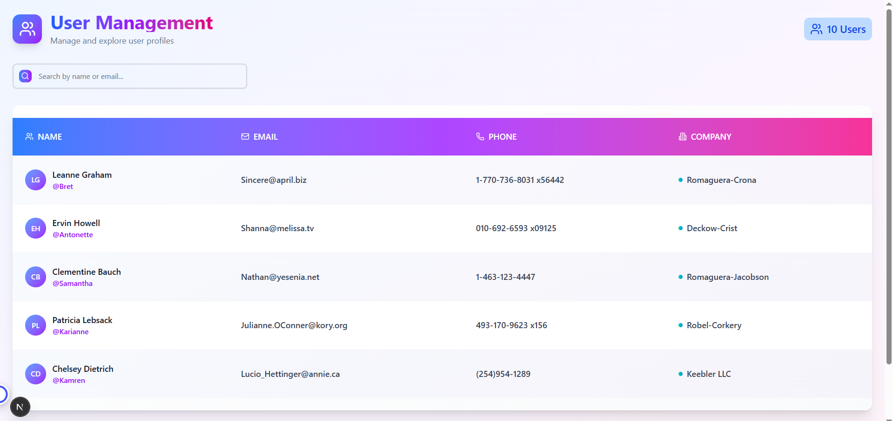

# User Management Dashboard Application

A responsive Dashboard Application built with Next.js (App Router) + TypeScript, fetching data from JSONPlaceholder API.  
The app includes User List, Search, Pagination, User Details Page, and GSAP animations for a smooth user experience.

---

## Live Demo
[View Live Project](https://bitsec-management-7urr93fac-fahim-sarkers-projects.vercel.app/users)

---

## Features

- User List Page
  - Displays all users fetched from JSONPlaceholder API.
  - Includes search functionality (filter by name or email).
  - Pagination with limited users per page.
  - Row click interactions.

- User Details Page
  - Opens on clicking a user’s row/name.
  - Displays detailed user information (name, email, phone, company, address, website).
  - Easy navigation back to the user list.

- Responsive Design
  - Works well on desktop, tablet, and mobile.

- Animations
  - Integrated GSAP for smooth animations.
  - Creative transitions and entry effects for list items.

## Tech Stack

- Next.js 14 (App Router)
- TypeScript
- Tailwind CSS
- ShadCN/UI
- GSAP (animations)
- JSONPlaceholder API

1. Clone the repository  
   git clone https://github.com/fahim-sarker/Bitsec-Management
   cd my-app
   npm install
   npm install

## ScreenShort
